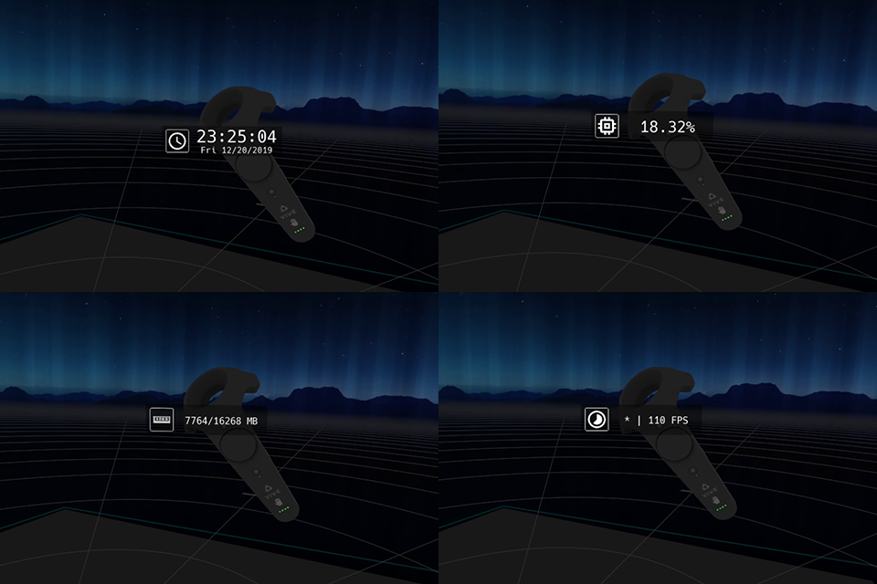
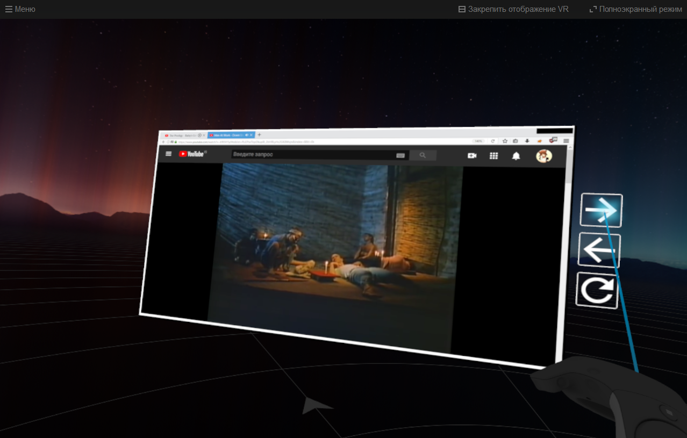

# OpenVR Widgets
Set of simple overlay widgets for usage in SteamVR environment.  
Application supports Windows 7, 8, 8.1 and 10.

# Installation
* Grab latest [release](../../releases/latest) for your platform.
* Extract archive to your preferable folder.
* Launch 'openvr_widgets' binary.
* Optional: Enable auto-launch in SteamVR settings.

# Settings
Editing 'settings.xml' allows to make own changes to widgets.  
List of global settings:
* **update_rate** - update rate in milliseconds. Default value is 11, that corresponds to 90 FPS.
* **language** - applied language to widgets. Available values: en, ru. Default value is 'en'.

# Stats overlay widget

* **Activation:** Double press on grip button of right hand controller.
* **Deactivation:** Release grip button of right hand controller.
* **Behaviour:** Follows right hand controller, transparency changes according to view angle on controller.
* **Features:** Shows current system time, CPU load and RAM usage. Cycle through stats with trigger button while overlay is visible.
* **Modifications:**
  * **Font:** Custom font can be set by changing 'watch_font' setting. Default value is 'Hack-Regular.ttf'. Refer to [Hack font repository](../../../../source-foundry/Hack).
  
# Windows capture overlay widget

* **Activation:** Double press on grip button of left hand controller.
* **Deactivation:** Double press on grip button of left hand controller.
* **Behaviour:** Displays your current visible system windows.
* **Features:**
  * **Movement:** Double press on trigger button of left hand at the center of overlay to attach it to your hand. Double press again to detach.
  * **Resize:** While overlay is attached to hand, bring right hand controller closely to overlay and double press trigger button. Move your right hand controller to adjust preferable size. Let go trigger button on your right hand controller to stop resizing.
  * **Window change:** To change captured window bring SteamVR dashboard, additional buttons will appear on the right side of overlay:
    * **Pin:** Pin widget to prevent interactions outside of SteamVR dashboard.
    * **Left:** Cycle window to left.
    * **Right:** Cycle window to right.
    * **Update:** Update stored list of windows. Helpful when new window has appeared or old has been destroyed.
  * **Interaction:** You can interact with captured window using trigger as click and touchpad as scroll. Note: Not all active and non-active windows accept click and scroll messages sent via Windows API.
  * **Modifications:**
    * **Capture rate:** You can adjust capture rate by changing 'capture_rate' value. Default value is 66 milliseconds that corresponds to ~15 frames per second.
